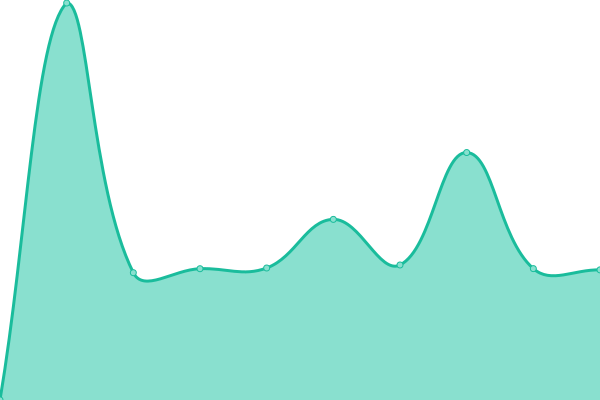
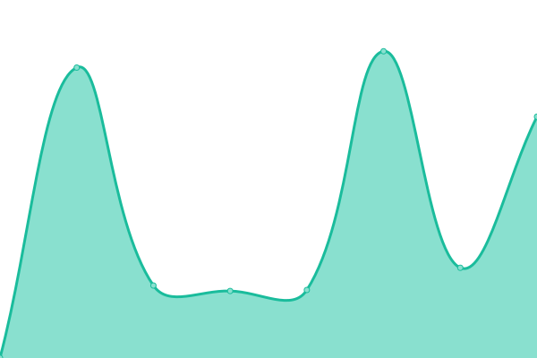

# [📈 Live Status](https://demo.upptime.js.org): <!--live status--> **🟩 All systems operational**

This repository contains the open-source uptime monitor and status page for [okj579](https://demo.upptime.js.org), powered by [Upptime](https://github.com/upptime/upptime).

With [Upptime](https://upptime.js.org), you can get your own unlimited and free uptime monitor and status page, powered entirely by a GitHub repository. We use [Issues](https://github.com/okj579/upptime/issues) as incident reports, [Actions](https://github.com/okj579/upptime/actions) as uptime monitors, and [Pages](https://demo.upptime.js.org) for the status page.

<!--start: status pages-->
<!-- This summary is generated by Upptime (https://github.com/upptime/upptime) -->
<!-- Do not edit this manually, your changes will be overwritten -->
<!-- prettier-ignore -->
| URL | Status | History | Response Time | Uptime |
| --- | ------ | ------- | ------------- | ------ |
|  [Cloud](https://cloud.okj.name) | 🟩 Up | [cloud.yml](https://github.com/okj579/upptime/commits/HEAD/history/cloud.yml) | 

 1975ms
     
 | 

<a href="https://okj579.github.io/upptime/history/cloud">94.05%</a>
    

|  [Paris Ever After](https://www.pariseverafter.com) | 🟩 Up | [paris-ever-after.yml](https://github.com/okj579/upptime/commits/HEAD/history/paris-ever-after.yml) | 

 686ms
     
 | 

<a href="https://okj579.github.io/upptime/history/paris-ever-after">99.77%</a>
    

|  [bill](https://bill.okj.name) | 🟩 Up | [bill.yml](https://github.com/okj579/upptime/commits/HEAD/history/bill.yml) | 

 135ms
     
 | 

<a href="https://okj579.github.io/upptime/history/bill">100.00%</a>
    

|  [jack](https://jack.okj.name) | 🟩 Up | [jack.yml](https://github.com/okj579/upptime/commits/HEAD/history/jack.yml) | 

 524ms
     
 | 

<a href="https://okj579.github.io/upptime/history/jack">94.51%</a>
    

|  [river](https://river.okj.name) | 🟩 Up | [river.yml](https://github.com/okj579/upptime/commits/HEAD/history/river.yml) | 

 140ms
     
 | 

<a href="https://okj579.github.io/upptime/history/river">100.00%</a>
    

<!--end: status pages-->

[**Visit our status website →**](https://demo.upptime.js.org)

## 📄 License

- Powered by: [Upptime](https://github.com/upptime/upptime)
- Code: [MIT](./LICENSE) © [okj579](https://demo.upptime.js.org)
- Data in the `./history` directory: [Open Database License](https://opendatacommons.org/licenses/odbl/1-0/)
